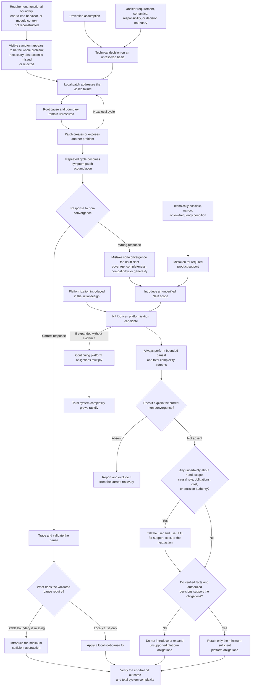

# Backtrace Review

## Purpose and principles

Step out of the current patch cycle. Return to the intended user outcome and trace
the assumptions, decisions, and responsibility boundaries that keep producing
problems. First establish whether the design can meet the requirements, then assess
whether its complexity is proportionate.

Reason from first principles: derive necessary capabilities and responsibilities
from current user goals, verified facts, and hard constraints. Do not treat the
current implementation, historical patches, or familiar practices as fixed premises.
This is not design from intuition alone; mature theory, existing solutions, and
empirical evidence remain important inputs.

First trace the upstream conditions that can prevent convergence or expand the response beyond the
demonstrated need:

- An unverified assumption can enter a technical decision while a requirement, responsibility, or
  semantic boundary remains unclear. A local fix can then address the visible failure without
  correcting that condition. The patch can create or expose another problem, which starts another
  local cycle. Repeated failed fixes or review cycles can be mistaken for evidence that the solution
  needs broader completeness, compatibility, traceability, or other non-functional requirement
  (NFR) coverage. This can turn a bounded response into general platform obligations.
- Reviewing only the visible symptom without reconstructing the requirement, functional boundary,
  end-to-end behavior, and relevant module architecture can hide the responsible system boundary.
  Conflating abstraction with entropy is one form of this error: a necessary abstraction can be
  rejected as over-abstraction. The resulting local fixes can remain individually small while
  leaving the cause unresolved and growing total system complexity through symptom-patch
  accumulation.
- A technically possible, narrow, or low-frequency condition does not by itself create a product
  support obligation. The condition can be mistaken for required support, which can invent or
  broaden an NFR and trigger NFR-driven platformization.

Test two distinct, non-exclusive causal mechanisms through which unresolved conditions can grow
complexity:

- **Symptom-patch accumulation:** Successive local fixes address the latest counterexample without
  correcting the requirement, responsibility, semantic, or module boundary that causes it. Each
  patch can be small while total concepts, exceptions, coupling, and verification cost grow.
- **NFR-driven platformization:** An NFR promotes a bounded quality concern into general
  infrastructure and creates continuing variant, extension, lifecycle, compatibility, registration,
  synchronization, operation, or maintenance obligations.

Either, both, or neither mechanism can be present. Repetition and diff size do not prove symptom-patch
accumulation. An NFR label does not prove platformization. This causal sequence is a high-risk
compounding path to test, not a required sequence or an automatic diagnosis. Either mechanism can
occur independently, and NFR-driven platformization can also be introduced in the initial design.
Treat every identified or suspected instance of NFR-driven platformization as a high-risk signal
that requires bounded causal and total-complexity screens, regardless of when or why it appeared.
An established support obligation does not exempt the associated platformization candidate from
either screen. Do not reject a candidate automatically.

Abstraction is not entropy by itself. When root-cause analysis establishes a stable responsibility,
semantic, module, or variation boundary that the current design does not own, introduce the minimum
sufficient abstraction required to own it. Avoiding that necessary abstraction and continuing with
local symptom patches can increase total system entropy even when each patch is small. Treat an
abstraction as excessive only when its scope or continuing obligations exceed the demonstrated cause
and need.

### Causal map

Use this map to test relationships, not as a required sequence or a mechanical decision tree. It
shows the common escalation path, the valid root-cause recovery paths, and two other routes to
platformization. One route promotes a technical possibility into a support obligation. The other
route introduces platformization in the initial design.

Optimize the total cost of understanding, validating, changing, and operating the
solution, not the size of the current diff. A larger refactor or rewrite must also
justify its cost. "Cleaner" is not sufficient evidence.

## When to start and what to pause

Start when the same issue repeatedly reopens, failures move across adjacent
boundaries, fixes need further supporting fixes, or tests grow without progress
toward the original acceptance criteria. There is no fixed iteration threshold.
Normal exploration, changed requirements, environment failures, and unrelated defects
can also cause repeated work.

Tell the user that you are starting a backtrace review. Pause further patches,
interfaces, and compatibility rules along the disputed approach. Preserve the
workspace, reproducible failures, and verified behavior. Continue relevant read-only
checks and bounded validation. Necessary, already-authorized emergency containment
can continue, but identify the root-cause work and follow-up checks it does not replace.

This skill produces a review and recovery recommendation by default. It does not
authorize implementation, requirement changes, commits, pushes, merges, or external
messages. Existing authorization remains valid within its scope. Before changing
product promises, support scope, or materially expanding implementation scope,
obtain approval from the designated human decision owner, or from the user if no
owner has been designated.

## Workflow

### 1. Reconstruct the goal and factual baseline

- Pin the implementation revision, relevant issue or pull request, requirements,
  acceptance criteria, and current architecture decisions. Distinguish the original
  user problem, currently approved requirements, and goals added during implementation.
  Historical records explain past decisions; they are not automatically current requirements.
- Define completion through observable outcomes. Identify behavior to preserve, hard
  constraints, actual consumers, and exclusions. Translate a prescribed mechanism,
  such as a field, adapter, or gate, back into the problem it is meant to solve.
- Assess the user need, the proposed mechanism, and the breadth of the current
  interpretation separately. A wrong mechanism does not invalidate the need. Do not
  make the task appear complete by silently reducing acceptance or removing necessary checks.

### 2. Establish support scope and limit auxiliary mechanisms

Compatibility, identity traceability, and evidence retention are core or auxiliary
according to the product's current goals and hard constraints, not their names.
They can be essential to acceptance, safety, data integrity, or required auditing.
Explaining implementation details, covering unpromised scenarios, or preparing
"just in case" does not automatically make them product capabilities.

- **Do not overengineer non-core, auxiliary mechanisms.** Before adding, retaining,
  or extending one, identify the confirmed goal or evidence-backed risk it serves,
  why simpler handling is insufficient, and its state, coupling, and maintenance
  costs. Technical possibility, completeness, or a reviewer's preference alone does
  not justify these costs.
- Distinguish evidence needed to validate a design from evidence capabilities built
  into the product. Testing an assumption does not require permanent end-to-end
  identity, provenance, or proof retention. Such capabilities need their own
  requirement and cost justification.
- For every identified or suspected instance of NFR-driven platformization, trace the NFR to its
  current requirement, hard constraint, demonstrated loss, supporting evidence, and decision owner.
  Name the continuing platform obligations, then test whether its decisions or obligations explain
  the current failure, repeated rework, or complexity growth. Classify it as a confirmed cause,
  hypothesis, absent, or unresolved because of an evidence gap. Keep the instance under review until
  the uncertainty is resolved. If the relationship is absent, exclude it from the current recovery;
  `entropy-review` owns any separate proportionality concern.
- Do not introduce or expand platform obligations to compensate for repeated failed fixes or review
  cycles, an unverified assumption, or an unresolved responsibility or semantic boundary. First
  establish the NFR need and scope with evidence. Apply the HITL rule below to remaining support or
  cost uncertainty before dependent work continues.
- When any uncertainty remains about support scope or an NFR-driven platformization candidate,
  including its existence, need, scope, causal role, obligations, acceptable cost, or decision
  authority, tell the user and use **human-in-the-loop (HITL) decision-making** before dependent
  work continues. Present known facts, uncertainties, the effects of support and non-support,
  simpler options, and a recommendation.
  Ask the designated human decision owner, or the user if no owner has been designated,
  to decide support scope, acceptable cost, or the next action under unresolved evidence, as
  applicable. Bounded investigation can come first, but technical validation cannot replace a
  product decision. Do not implement the most complex case by default.
- A product can explicitly decline support for a very rare situation outside its
  core promises. Explain the evidence for occurrence, consequences, and support cost;
  do not assert rarity without evidence. Low frequency alone is insufficient: assess
  severity and hard constraints too. Define necessary refusal or failure behavior,
  messages, and checks. Do not silently corrupt data, report false success, or build
  a general compatibility platform merely to reject a few cases.

Follow established support policy. Reducing an existing promise requires the
appropriate approval and updated acceptance criteria. While awaiting HITL, pause
only work that depends on the decision; continue unrelated authorized work.

### 3. Trace symptoms back through decisions

- Select the iterations that can explain repeated rework. Trace each symptom,
  response, underlying assumption or decision, observed result, and new problem or
  maintenance obligation. Go back far enough to explain the failure, not through
  every historical event.
- Separate the original defect, patch-induced defects, and newly discovered defects
  that already existed. Investigate mechanisms that mainly support another mechanism:
  compensating flags, duplicate state, special branches, extra counters, and calling
  order conventions. These are clues, not defects by definition.
- Identify what supported each key decision then and now. Requirements, technical
  facts, preferences, and review suggestions are different kinds of input. An accepted
  architecture decision record (ADR), a proposed review fix, or a reply saying
  "resolved" does not by itself establish technical correctness.
- Starting from the current outcome, test whether successive local fixes address only the newest
  counterexample while leaving the responsible requirement or boundary unchanged and losing the
  end-to-end goal. Trace the accumulation through assumptions, decisions, compensating mechanisms,
  and responsibility boundaries. Separate local review passes do not establish that the combined
  solution works. Past investment and merged patches alone do not justify retaining a design;
  migration cost and real dependencies do belong in the comparison.
- Test whether repeated failures or review cycles were mistaken for evidence that broader NFR
  coverage was necessary and produced a platformization proposal or new platform obligations. Trace
  that transition as a separate technical or product decision.
- Give a testable causal explanation. Sequence alone does not establish causation;
  multiple causes can contribute. Separate confirmed causes, hypotheses, and missing
  evidence rather than completing a story that cannot be disproved.

### 4. Validate the assumptions that determine the approach

For each assumption whose failure would change the approach, identify its source,
dependent decisions, supporting and opposing evidence, and the cheapest check that
distinguishes whether it holds.

- Separate testable technical facts from product policy. "An old process can remain
  alive" is a technical claim; "the product must support mixed versions" is a policy.
  The first does not imply the second.
- Mark unsupported claims as unverified, not false. Record the version, environment,
  and scope of existing evidence; check for stale evidence or unjustified extrapolation.
  Prioritize impact on requirements and architecture, especially assumptions that
  support a whole group of mechanisms. Do not investigate every uncertainty.
- Choose a small discriminating check: inspect original requirements, primary
  specifications, or actual implementations; construct a counterexample; run a boundary
  experiment or real integration; or obtain an independent interpretation of the
  contract. State what result would disprove the assumption before running the check.
- Check whether tests repeat the implementation's assumptions. When useful, test the
  old implementation, a deliberately wrong implementation, or a counterexample to
  establish that the test distinguishes them. Mocks and fakes can isolate a question,
  but cannot be the sole evidence for the external behavior they simulate. Green CI
  does not establish an untested architecture claim.

### 5. Derive orthogonal boundaries from first principles

Temporarily set aside the constraints imposed by existing patches. If the current
implementation did not exist, which facts, rules, state transitions, and failure
behaviors would the same requirements still need? Identify who owns rules and state,
who translates representations, who coordinates calls, and where results and failures
become public contracts. Examine only boundaries involved in the causal explanation,
not the entire system by default.

Use **orthogonal basis** as a metaphor for concerns that cover current requirements,
have distinct meanings and reasons to change, and avoid unnecessary overlap. This
is not a mathematical proof or a demand for zero dependencies. Test the decomposition:

- **Coverage and necessity:** Do current requirements and invariants have clear owners?
  Is each concern necessary, or does it merely support another patch? Do not wrap
  every symptom or exception in a separate abstraction.
- **Independence:** Can a concern change without changing unrelated business meaning?
  Reconsider boundaries when modules always change together, independently decide the
  same fact, or rely on implicit call order. Give necessary shared constraints explicit
  owners and coordination rules.
- **Composition:** Do individually correct capabilities preserve invariants together?
  Check supported combinations and boundary cases for hidden shared state, conflicting
  precedence, and semantic changes. Module tests alone do not establish this.

Then inspect the design to retain or revise:

- **Domain-driven design (DDD):** Align domain language, business rules, state lifecycle,
  and responsibility. Do not confuse a technical representation with domain meaning
  or maintain independent authorities for one fact. Do not require aggregates,
  repositories, or bounded-context splits just to apply DDD.
- **Deep modules:** Use a small, clear interface to hide meaningful implementation
  complexity. Check whether callers must still know provenance, hidden state, special
  ordering, or internal branches. A field named private does not establish encapsulation.
- **Interfaces and seams:** Separate real responsibilities, lifecycles, and reasons to
  change. Make inputs, outputs, invariants, failure semantics, and conversion ownership
  explicit. Check promised semantics when replacing an implementation or serializing
  and reloading a public value; do not demand lossless round trips from every data type.
- **Semantic completeness:** Look for state leaking across layers, callers repairing
  results, and abstractions that only forward calls. If two implementations could
  satisfy the prose yet differ on an important observable result, clarify the contract
  instead of adding another exception.

### 6. Reconsider change scope and compare total complexity

Compare continued local patching with the smallest sufficient adjustment that removes the cause
and preserves the agreed observable completion outcome, all behavior identified for preservation,
and every confirmed requirement and hard constraint. Consider rollback or rewriting when
justified. Do not invent alternatives merely to fill a list.

- Compare one-time implementation and migration risks with ongoing concepts,
  interfaces, state, synchronization rules, test combinations, operations, and change
  costs. Identify concrete obligations added or removed, not scores based on lines,
  files, or abstraction counts.
- For confirmed symptom-patch accumulation, resolve the validated cause instead of the latest
  symptom. If the cause demonstrates a stable responsibility, semantic, module, or variation
  boundary that the current design does not own, introduce the minimum sufficient abstraction to
  own it. Do not continue patching to avoid this necessary abstraction, and do not invent an
  abstraction when evidence shows only a local cause.
- For each NFR-driven platformization candidate, compare the evidenced need and scope with its
  variant, extension, lifecycle, compatibility, registration, synchronization, operation, and
  maintenance obligations. Retain only the minimum sufficient obligations after evidence establishes
  their need and scope. Evidence does not exempt the candidate from the causal and total-complexity
  screens. Apply the HITL rule above when the need, scope, causal role, or acceptable cost remains
  uncertain; do not default to keep, expand, simplify, or remove.
- Keep complexity that serves real requirements, hard constraints, or evidence-backed
  risks. Remove mechanisms needed only by invalidated assumptions and their compensating
  patches. Preserve demonstrated safety, integrity, compliance, auditing, or an explicit product
  promise and the minimum sufficient obligations needed to satisfy it. A mechanism with an
  independent purpose must not disappear with its old rationale.
- Let design scope cover the cause and affected responsibility boundaries; keep
  implementation batches verifiable and reversible. **Small batches do not require
  preserving a wrong architecture.** Establish the target structure and its basis,
  then migrate incrementally. A few changed lines cannot replace root-cause and
  system-level reasoning. Conversely, a configuration defect or local rule error does
  not justify a system-wide redesign.
- Justify a larger change by the mistaken constraints or continuing costs it removes,
  and explain why a smaller option is insufficient. Match migration, compatibility,
  and rollback work to the actual installed base and data risks. Do not generalize
  one project's ability to use the latest version to every system.

### 7. Recommend recovery and prevent old assumptions from returning

Choose a primary conclusion: keep the design and address a local cause; validate a
key assumption first; refactor responsibility boundaries; roll back or rewrite; or
reconfirm requirements and constraints. Keep uncertainty explicit rather than choosing
a rewrite by intuition.

State what to keep, change, and remove. Identify the first judgment to validate and
the next end-to-end behavior or independently verifiable increment to deliver. Include
acceptance criteria, behavior that must not regress, remaining risks, and evidence
that would require another design review. If key evidence is unavailable, report the
gap and next check instead of continuing blind patches.

Obtain any required direction decision first. Once implementation is authorized,
revise affected requirements or design rationale, then reconcile code, tests, examples,
and issue or pull request descriptions. Validate the original problem and affected
boundaries against the agreed criteria. Preserve historical evidence while explicitly
superseding invalid conclusions, so old review suggestions do not become new requirements.

A completed review is not a completed task. The review needs an evidence-bounded
explanation and a next step that supports a decision; the task still needs to satisfy
its agreed acceptance criteria. If evidence supports the current architecture, end
the backtrace review and resume normal delivery. If further patches add compensation
without acceptance progress, revisit the affected assumptions and boundaries rather
than restarting an unbounded review of everything.

## Output

Lead with the conclusion, then report only the detail the task needs:

- The current goal, supported and unsupported scope, and facts behind the key decisions.
- Report the upstream cause or unresolved causal hypothesis and how it relates to each
  complexity-growth mechanism. Report a separate conclusion for symptom-patch accumulation. For
  every identified or suspected NFR-driven platformization, report its causal status, evidence and
  gaps, obligations, remaining uncertainty, and any related HITL decision or open decision with its
  owner. If symptom patches led to a platformization proposal or implementation, report the
  transition decision and its evidence. Also report each necessary abstraction, if any, and its
  demonstrated boundary, assumptions to validate, and necessary complexity to preserve.
- Recommended responsibility boundaries and changes, compared with the total cost
  and risk of continued local patching.
- Next validation, implementation scope, acceptance criteria, and open decisions
  with their decision owners.

If authorized implementation follows, separately report actual changes, validation,
artifact reconciliation, and remaining risks. When no substantive issue or NFR-driven
platformization candidate is found, say so and stop expanding the review. If a candidate has no
causal relationship to the current task, report the bounded result and exclude it from recovery.

Reuse existing issues, ADRs, tests, and review records. Short tasks do not need a new
assumption ledger, scorecard, gate, or full architecture specification. Retain records
only when they change a decision, support validation, or help another worker continue.

## Typical errors and corrections

**Turning technical possibility into support policy.** A tool can use the current
plugin, but "an old plugin might still be alive" leads to capability probes, mode
counters, and result markers. Confirm whether mixed versions are promised; use HITL
when unclear instead of continuing a compatibility layer. The product can require
an upgrade and clearly reject unsupported versions. Independently upgrading customers
with a support promise can make compatibility necessary; do not copy the removal
decision into that setting.

**Patching a representation boundary with provenance guesses.** One model interprets
both raw responses and public results. A new field changes meaning after serialization
and reloading, so private provenance markers and branches are added. Separate the
responsibilities of interpreting an external protocol and expressing public semantics.
Check whether a boundary adapter should validate and translate raw responses while
public values express only their contract. Validate promised round trips and invalid
inputs. The actual boundary determines whether and where an adapter is useful; do
not generate a wrapper for every model.

**Mistaking small patches for low complexity.** An import queue provides at-least-once
delivery, while each business import must have one effect. Successive response caches,
recent-ID sets, and time windows are small diffs but make correctness depend on several
states. Revisit business identity, effect commit, retry semantics, and deduplication
ownership. Test duplicate delivery and an effect committed before acknowledgment.
Identity and deduplication can be core correctness here, not optional features to
delete because someone calls them traceability or auxiliary mechanisms.

**Compounding symptom patches with NFR-driven platformization.** A same-host artifact smoke needs
to run one artifact and observe its result. A fix for one platform-specific coverage gap introduces
a bounded cross-platform inventory. Membership rules, hashing, caps, and truncation accumulate, but
the result still cannot prove complete content identity. Trace the patches to the unsupported
completeness NFR. Keep the smoke, correct its responsibility boundaries, and remove or independently
justify the platform obligations.

## Relationship to other methods

This skill determines whether symptom-patch accumulation or NFR-driven platformization caused a
non-converging task and identifies the affected requirements, decisions, boundaries, and platform
obligations. First principles guide the derivation of necessary capabilities and orthogonal
concerns. The requirements, assumptions, counterexamples, and evidence approach of
validation-driven-design tests those judgments. `entropy-review` owns the deeper proportionality
review of architecture or module obligations. Use those methods for deeper work when needed; this
skill does not require loading other skills or reproducing their full workflows.
